# Camera FX

A browser extension that applies effects to your webcam on any website. The site receives the already processed video; audio passes through untouched.

It works in Google Meet, Discord, Telegram Web (including video messages) and any other site that uses the camera through the browser.

Face tracking runs locally with MediaPipe Face Landmarker. Video never leaves the browser.

<p align="center">
  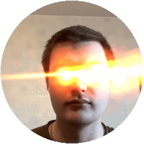
  &nbsp;&nbsp;
  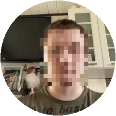
</p>
<p align="center"><em>Recorded as Telegram Web video messages with the extension on</em></p>

## Effects

Pick an effect in the extension popup; each one has its own settings there. The popup UI is in Russian, so the label shown in it is given in parentheses.

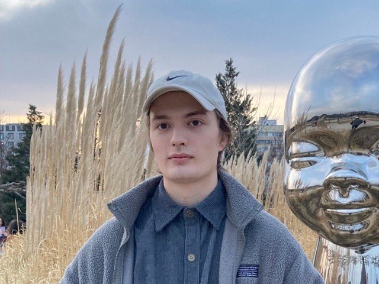

| | |
| --- | --- |
| 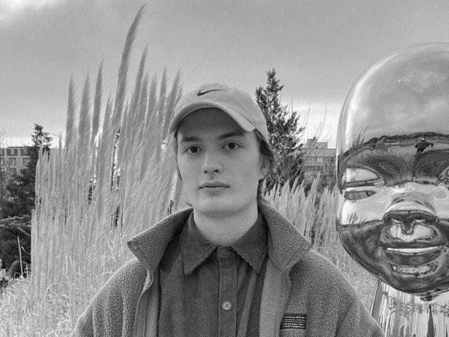 | 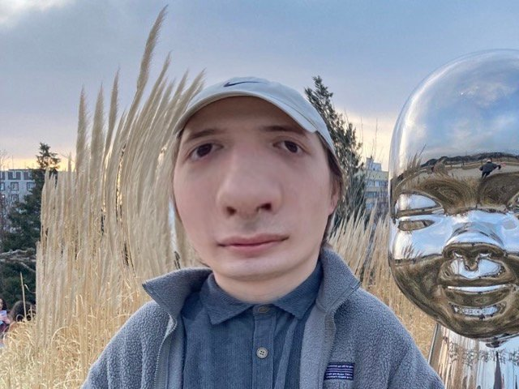 |
| **Grayscale** (`Ч/Б`). Black and white picture. | **Lens** (`Линза`). Fisheye bulge centered on the nose. Radius and strength are adjustable; negative strength pinches the face instead. |
| 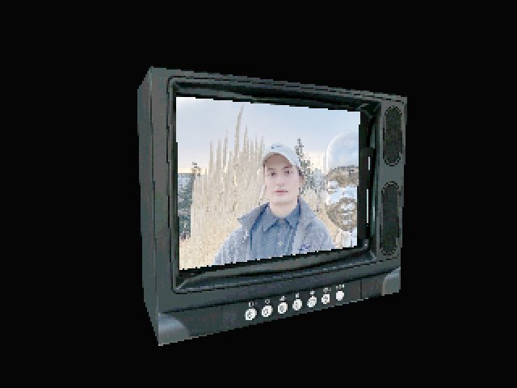 | 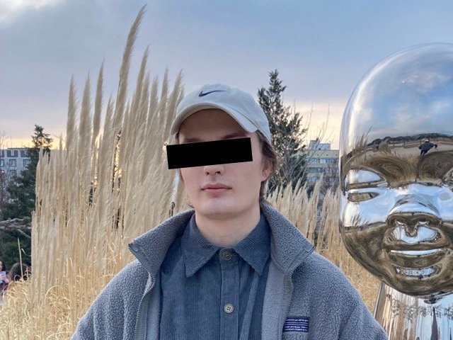 |
| **PS1 3D** (`PS1 3D`). Your video on the screen of a swaying low-poly PlayStation 1 style model: TV, gun, head, car or washing machine. | **Eye censorship** (`Цензура глаз`). Black bar over the eyes that rotates with the head. Size and offset are adjustable. |
| 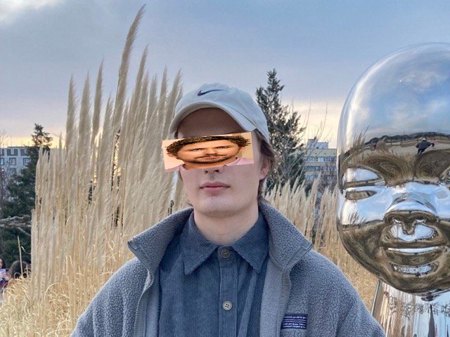 | 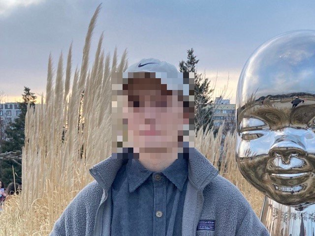 |
| **Image over eyes** (`Картинка на глаза`). Any image of your choice over the eyes, following the face. | **Pixelated face** (`Пиксельное лицо`). News-style face pixelation with adjustable pixel size and margin around the face. |
| 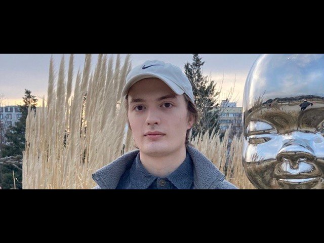 | 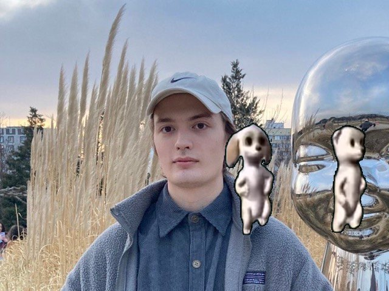 |
| **Letterbox** (`Letterbox`). Cinematic black bars with a choice of aspect ratio (2.39:1, 2.35:1, 16:9 and more), optionally in black and white. | **Green screen** (`Зелёный экран`). A green screen video over the camera with the background keyed out. Upload your own video, then move, scale and rotate it. |
| 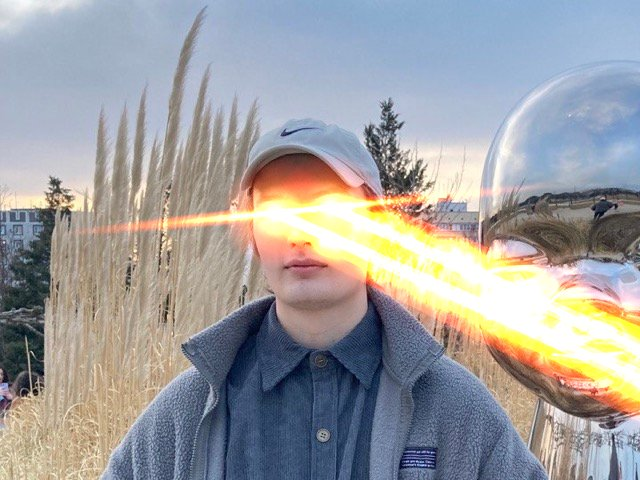 | |
| **Laser eyes** (`Лазеры из глаз`). Fiery beams with sparks shooting from the pupils, either where the head is turned or at a fixed angle. Closing an eye turns its laser off. | |

## Installation

The extension is not published in the stores yet, so it is installed from source.

### Download

Models and libraries are stored in [Git LFS](https://git-lfs.com), so `git lfs` must be installed:

```bash
git lfs install
git clone https://github.com/danilwithonei/camera_fx.git
```

> GitHub's "Download ZIP" button puts text placeholders instead of the models into the archive by default, and the extension won't work with them. Use `git clone`.

### Google Chrome and other Chromium browsers (Edge, Brave, Opera, Yandex Browser)

Version 111 or newer is required.

1. Open `chrome://extensions/` (`edge://extensions/` in Edge).
2. Turn on **Developer mode** in the top right corner.
3. Click **Load unpacked** and select the `camera_fx` folder (the one containing `manifest.json`).
4. Pin the extension: puzzle icon next to the address bar → pin next to **Camera FX**.
5. Open a site with video calls. If the camera was already on there, reload the tab and turn the camera on again.
6. Click the Camera FX icon and choose an effect. Effects switch on the fly, no need to restart the camera.

The extension stays installed after a browser restart. After updating the files (`git pull`), click the reload button on the extension's card at `chrome://extensions/` and reload the site's tab.

### Firefox

Version 128 or newer is required.

1. Open `about:debugging#/runtime/this-firefox`.
2. Click **Load Temporary Add-on** and select `manifest.json` in the `camera_fx` folder.
3. If the popup says there is no access to sites (`Нет доступа к сайтам`), click the button below it to grant access.

A temporary add-on is removed when Firefox closes. To install it permanently, the extension has to be signed on addons.mozilla.org; an unlisted signature via `web-ext sign` is enough.

In Firefox, uploading your own image or video opens the settings in a tab, because Firefox doesn't allow picking a file from a popup.

### If an effect doesn't show up

- Reload the site's tab: the extension hooks into the page when it loads.
- Check that the effect switch (`Эффект`) at the top of the popup is on.
- Face effects (lens, censorship, pixelation, image, lasers) need 1–2 seconds to load the model the first time.

## How it works

| File | Purpose |
| --- | --- |
| `inject.js` | Runs in the page context before the page's own scripts, wraps `getUserMedia` and draws the effects on a canvas |
| `content.js` | Passes settings from `chrome.storage` to `inject.js` |
| `popup.html`, `popup.js` | Settings popup |
| `lib/` | Three.js and MediaPipe, bundled so that sites' CSP can't block them |
| `models/` | MediaPipe face model |
| `models3d/` | 3D models for the PS1 effect |
| `green_screens/` | Default green screen video |
| `image.png` | Default image for "Image over eyes" |
| `docs/` | Screenshots and GIFs for this README |
